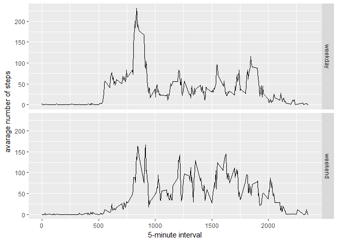

# Reproducible Research: Peer Assessment 1

## Loading and preprocessing the data
This include loading the csv file, removing all NA values and converting the data variable to a suitable format.


```r
myrawdata <- read.csv("activity.csv", header = TRUE)
mydata <- myrawdata[complete.cases(myrawdata), ]
mydata$date <- as.Date(mydata$date, format = "%Y-%m-%d")
```


## What is mean total number of steps taken per day?
We will first create a histogram of the total number of steps taken each day. Check it out:


```r
totalsteps <- tapply(mydata$steps, mydata$date, FUN = sum)
totalsteps <- totalsteps[!is.na(totalsteps)]
library(ggplot2)
```

```
## Warning: package 'ggplot2' was built under R version 3.3.3
```

```r
qplot(totalsteps, binwidth = 500, xlab = "Total steps taken each day", ylab = "Count", main = "Histogram of the total number of steps taken each day")
```

<!-- -->

Now, we will calculate the **mean** and **median** total number of steps taken each day.

```r
mean1 <- round(mean(totalsteps), digits = 2)
median1 <- median(totalsteps)
```
The mean is 10766.19 and the median is 10765.

## What is the average daily activity pattern?
First, let's make a plot to view the daily activity pattern:

```r
avesteps <- tapply(mydata$steps, mydata$interval, mean, na.rm = TRUE)
avestepsdf <- as.data.frame(avesteps)
avestepsdf$interval <- unique(mydata$interval)
avestepsdf <- avestepsdf[ ,c(2,1)]

g <- ggplot(avestepsdf, aes(x = interval, y = avesteps))
g + geom_line() +
  xlab("5-minute interval") +
  ylab ("average number of steps taken") +
  ggtitle("The average number of steps taken for each 5-minute interval")
```

<!-- -->

Now, let's calculate the 5-minute interval that contains the maximum number of steps:


```r
maxsteps <- which.max(avestepsdf$avesteps)
timemaxsteps <- avestepsdf[as.numeric(maxsteps), ]
```

The 835 5-minute interval containts the maximum number of steps (206.1698113) steps.

## Imputing missing values

```r
missing <- sum(is.na(myrawdata))
```

The total number of missing values is 2304.

### Strategy to fill missing values
We will take the mean for that 5-minute interval to replace the missing values and create a new data frame.


```r
newdata <- merge(myrawdata, avestepsdf, by = "interval")
  
for (i in 1:nrow(newdata)){
  if(is.na(newdata[i, 2]) == TRUE){
      newdata[i, 2] <- newdata[i, 4]
  }
}
newdata <- newdata[ , c(2,3,1)]
```

Following is a histogram of the new dataset:


```r
totalsteps2 <- tapply(newdata$steps, newdata$date, FUN = sum)
totalsteps2 <- totalsteps2[!is.na(totalsteps2)]
library(ggplot2)
qplot(totalsteps2, binwidth = 500, xlab = "Total steps taken each day", ylab = "Count", main = "Histogram of the total number of steps taken each day with the new data")
```

<!-- -->

Let us again calculate the **mean** and **median** total number of steps taken each day with this new data set:

```r
mean2 <- round(mean(totalsteps2), digits = 2)
median2 <- median(totalsteps2)
```
The mean is 10766.19 and the median is 10766.1886792453.


```r
data <- c("remove NA", "replace NA")
means <- c(mean1, mean2)
medians <- c(median1, median2)

compare <- data.frame(data, means, medians)
compare
```

```
##         data    means  medians
## 1  remove NA 10766.19 10765.00
## 2 replace NA 10766.19 10766.19
```

## Are there differences in activity patterns between weekdays and weekends?
Following, we first create a new variable "type".

```r
weekdata <- newdata
weekdata$day <- weekdays(as.POSIXct(newdata$date))
weekdata$daytype <- ifelse(weekdata$day == "Saturday" | weekdata$day == "Sunday", "weekend", "weekday")
weekdata$daytype <- as.factor(weekdata$daytype)
```

Now, a panel plot follows:

```r
avesteps <- aggregate(steps ~ interval + daytype, data = weekdata, FUN = mean)
k <- ggplot(avesteps, aes(interval, steps)) + 
    geom_line() + 
    facet_grid(daytype ~ .) +
    xlab("5-minute interval") + 
    ylab("avarage number of steps")
k
```

<!-- -->
